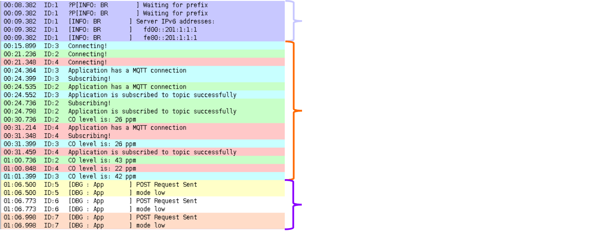
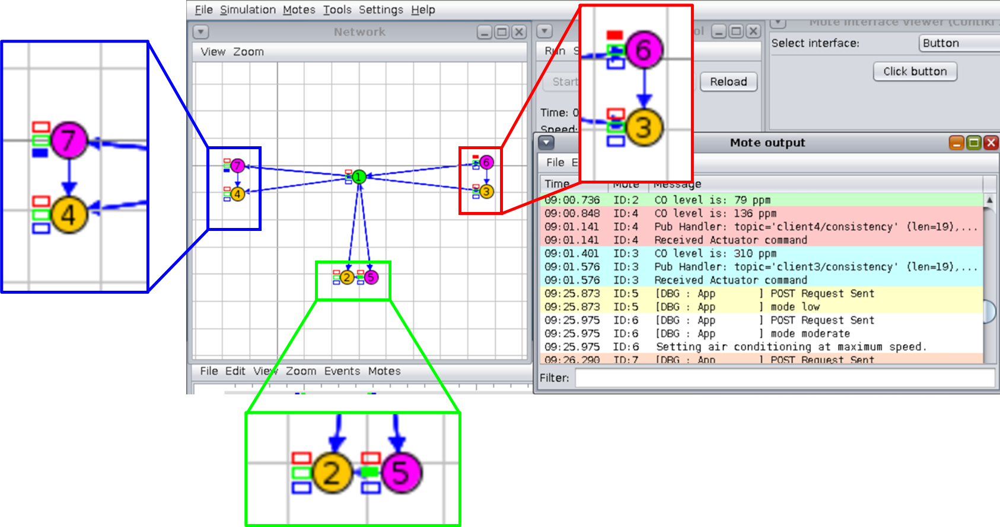
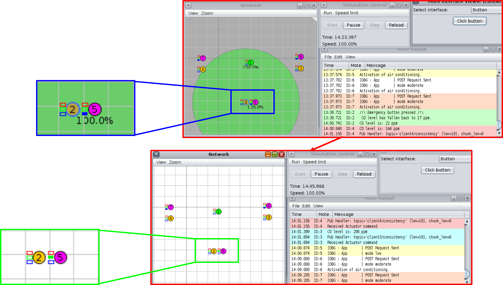
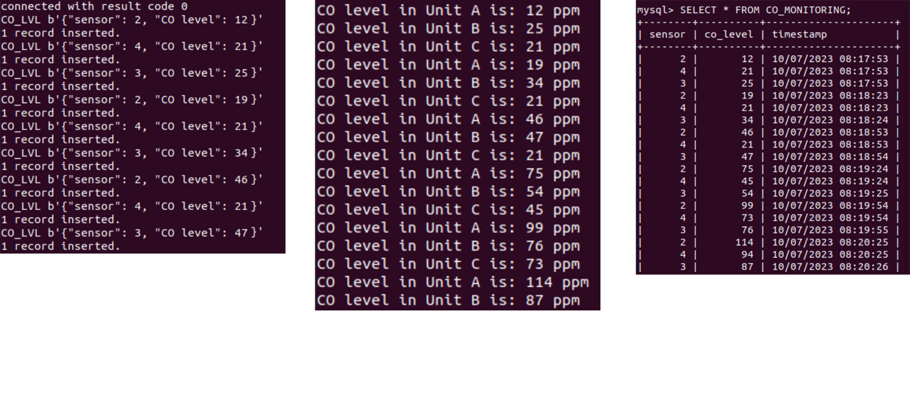
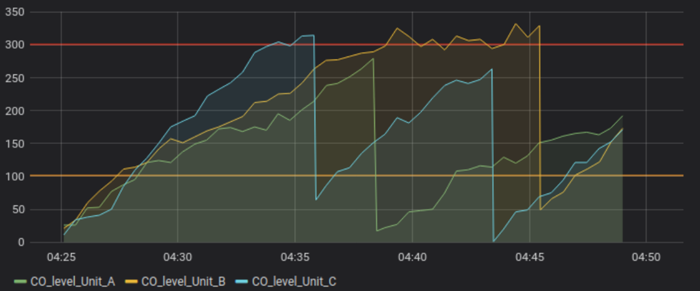

# Smart CO monitoring

### The aim of the project was to create an IoT telemetry and control system. I decided to find a solution to monitor the carbon monoxide level in factories.

### On this document the implementation and the details of the codes are not explained. For more information about the choices and the code please refer to the following document:  [Documentation.pdf](Documentation.pdf).

## 
##

## _Simulation on cooja:_
⚠️ **Warning**: Before using the simulation "project.csc", make sure *cooja* is installed on your computer. ⚠️

### Preparing the simulation:
> Once contiki and cooja are installed:
Download the directory project and place it in the following contiki directory:
```  
cd ./contiki-ng/
```

### Create the database
> Install MySQL:
```  
sudo apt update
sudo apt install mysql-server
sudo mysql_secure_installation
sudo mysql -u root
ALTER USER 'root'@'localhost' IDENTIFIED WITH mysql_native_password BY 'PASSWORD';
systemctl restart mysql.service
```


> Once MySQL is installed:
```  
CREATE DATABASE mydatabase;
USE mydatabase;
CREATE TABLE CO_MONITORING (sensor smallint, co_level int, timestamp int);
USE mydatabase;
SELECT * FROM CO_MONITORING;
```


### Opening cooja:
> Once cooja is installed:
```
contikier    
cd ./tools/cooja
ant run
```

### Opening the simulation:
> Once cooja is open:

Go to File, Open simulation and open project.csc 
Start the serial socket associated to the border router
Start the simulation

### Starting the border router:
> Once the simulation is started, in a new terminal:
```
cd ./contiki-ng/project/rpl-border-router
make TARGET=cooja connect-router-cooja
```

### Starting the MQTT application:
> Once the border router is started, in a new terminal:
```
cd ./contiki-ng/project/application
python3.7 mqtt_collector.py
```

### Starting the CoAP application:
> Once all the sensors have given at least a value, in a new terminal:
```
cd ./contiki-ng/project/application
python3.7 coap_actuator.py
```

At this stage the cooja mote output window should look like:



### The LEDs:
On the following screenshot of the simulation we can see that:

Sensor 2 : 79 ppm => Actuator 5 has its LED ${\color{green}green}$ (low mode)

Sensor 3 : 310 ppm => Actuator 6 has its LED ${\color{red}red}$ (high mode)

Sensor 4 :136ppm => Actuator 7 has its LED ${\color{yellow}yellow}$ (moderate mode)



### The use of the button:
When triggering a button, this acts like an emergency button that opens all the emergency exits. Thus the CO level drops instantly:



### Results:
After some time, the outputs on the terminal for the applications and the database should look like:




And here is a plot of a similation with Grafrana:


